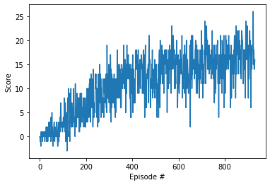

## Navigation : Udacity DeepRL Nanondegree project report
___

### Learning Algorithm

The learning algorithm used in this project is the basic Deep Q-Networks (DQN) algorithm provided
earlier in course. The model is a simple fully-connected network with two hidden layers, and
an output layer that is equal to the dimension of the action space. The DQN agent uses two such models --
one for the target network, which is only slowly updated to the learning network weights, and the learning
network itself, which is used online for generating new actions, and is the one that is optimized.

A replay buffer holds the most recent experiences -- this is implemented as a deque. This enables the de-correlation
of samples from which training is done. Training is done every few steps (not every step).

The agent is trained over many episodes, until we see the desired mean score over the last 100 episodes.

The various hyperparameters are here selected as the defaults provided earlier in the course. They were found to work very well!

Evaluation is done across 10 episodes.

### Plot of Rewards

The following plot shows the training loss curves for the trained agent, whose weights are saved in [checkpoint.pth](checkpoint.pth).

For this checkpoint, we selected `16.5` as the 100-episode average score required before terminating training. This was achieved in 1046 episodes.

The minimum required score of `13` was achieved in less than 600 episodes.

### Future Work

#### Hyperparameter optimization
More training cycles would allow one to find hyperparameters that are better with respect to training efficiency and/or overall average-reward performance.

#### Algorithmic improvements
As suggested in the course, the following more advanced variants can be tried : double DQN, a dueling DQN, and/or prioritized experience replay!