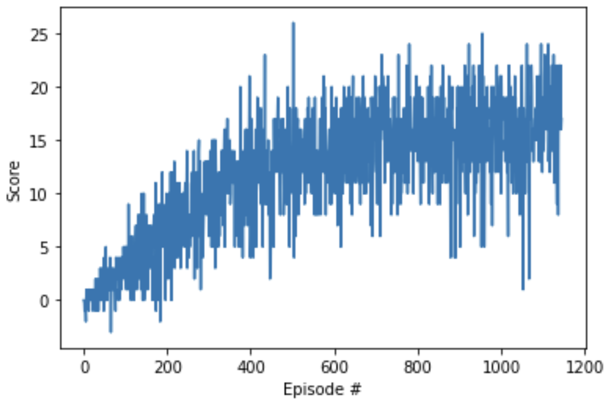

## Navigation : Udacity DeepRL Nanondegree project report
___

### Learning Algorithm

TODO : clearly describes the learning algorithm, along with the chosen hyperparameters. It also describes the model architectures for any neural networks.

### Plot of Rewards

### Future Work

TODO :